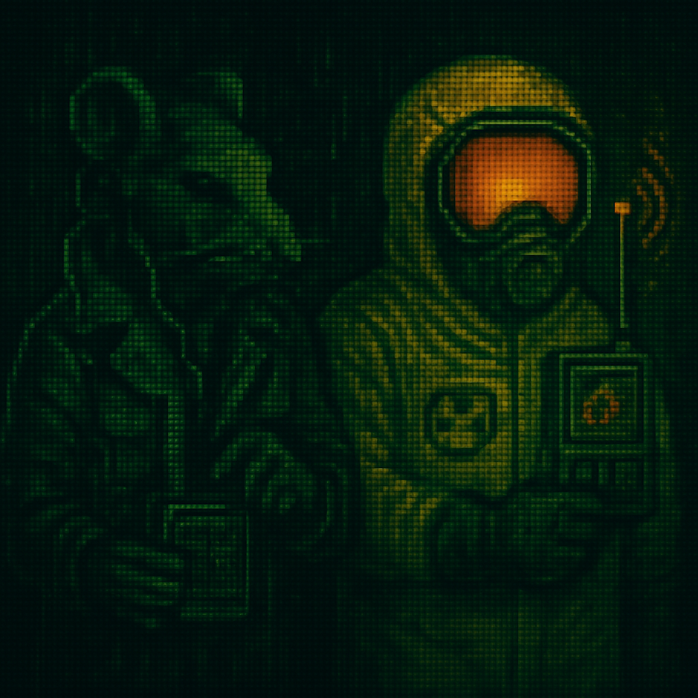

# VAULT HUNTER

> *Hunt the source. Contain the glow.*

A fast, grid-based web game. Join Special Agent Rat in a tile-scanning thriller across infamous radiation hotspots. Scan tiles, trace the hidden contamination source, and complete the mission before time runs out.

[▶ **Play on GitHub Pages**](https://ironsignalworks.github.io/vaulthunter/)



---

## Features

- **10×10 tactical grid** — Manhattan-distance heat hints (0–6) guide you to the source
- **Multiple locations** — Chernobyl, Fukushima, Three Mile Island, Kyshtym, and more — each with unique lore and intel
- **Mission mechanics** — Timer, energy management, and Geiger counter feedback
- **Mobile-first** — Keyboard and touch friendly, responsive layout
- **Zero build** — Pure HTML, CSS, and vanilla JavaScript — no frameworks

---

## How to Play

| Action | Result |
|--------|--------|
| **Click / tap** a tile | Scan it |
| **Numbers 0–6** | Heat toward source (higher = closer) |
| **≈** | Radiation (hurts energy) |
| **✶** | Intel (pauses timer, reveals lore) |
| **☢** | The source — find it to win |

**Controls**
- **Space / Enter** — Scan the focused tile
- **MUTE** — Toggle audio
- **MENU** — Return to main menu

---

## Run Locally

Static site — open `index.html` directly, or use a local server for best audio/path behavior:

```bash
# Python 3
python -m http.server 8000

# Python 2
python -m SimpleHTTPServer 8000

# Node (npx)
npx serve
```

Then open `http://localhost:8000` in your browser.

---

## Project Structure

```
├── index.html          # Main game (HTML + inline CSS)
├── script.js           # Game logic
├── site.webmanifest    # PWA manifest (icons, theme)
├── assets/
│   ├── intel/          # Intel collectible images
│   └── locations/      # Location backgrounds
├── music/              # Audio (menu, game, SFX)
└── *.png               # Sprites, icons, poster
```

---

## Tech Stack

- **HTML5** — Semantic markup, PWA-ready meta
- **CSS3** — Custom properties, clamp(), responsive layout
- **Vanilla JavaScript** — No dependencies
- **VT323** — Google Fonts (retro terminal aesthetic)

---

## License

© Iron Signal Works. All rights reserved.

---

## Contact

✉️ web@ironsignalworks.com
